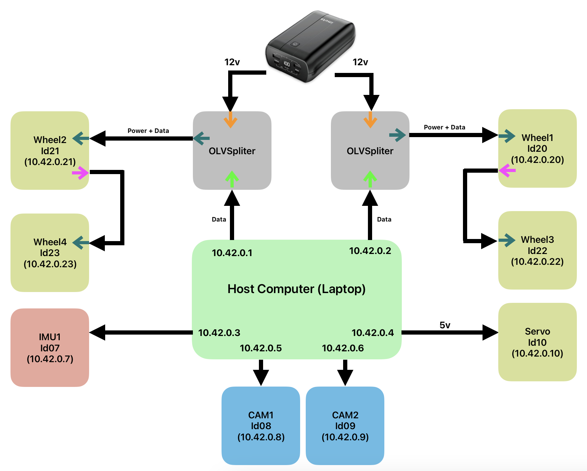

# Robot Base Tutorial

## A) Mechanics 

🪜 **Step1:**
Take one motor and add the boltx to it.

🪜 **Step2:**
Repeat this step to have 2 motors

🪜 **Step3:**
Take a 30 cm T-frame and add two boltx to each side of it.

🪜 **Step4:**
Make sure you lock the screws correctly.

🪜 **Step5:**
Then connect the T-frame structure to the motors.

🪜 **Step6:**
Then install another boltx to the wheel

🪜 **Step7:**
Then install the wheels. Check the step 10 to make sure you install the wheels in the currect direction.

🪜 **Step8:**
Build the complete frame for 4x motors.

🪜 **Step9:**
Install two other T-frame structures similar to previus step to have a cube shape base.

🪜 **Step10:**
Make sure you install the wheels correctly.

## B) Electronics and Components

🪜 **Step11:**

🪜 **Step12:**

## C) Software

