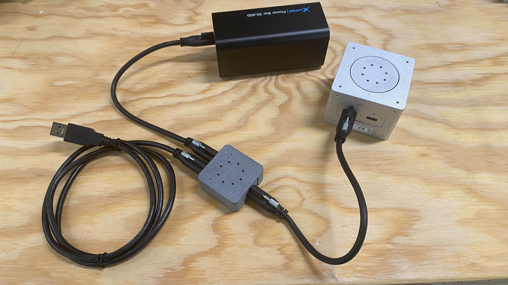

# Robot Building Tutorial

## A) Mechanics 

 **Step0:**

Prepare the boltx connector.

 **Step1:**
Take one motor and add the boltx to it.

 **Step2:**
Repeat this step to have 2 motors

 **Step3:**
Take a 30 cm T-frame and add two boltx to each side of it.

 **Step4:**
Make sure you lock the screws correctly.

 **Step5:**
Then connect the T-frame structure to the motors.

 **Step6:**
Then install another boltx to the wheel

 **Step7:**
Then install the wheels. Check the step 10 to make sure you install the wheels in the currect direction.

 **Step8:**
Build the complete frame for 4x motors.

 **Step9:**
Install two other T-frame structures similar to previus step to have a cube shape base.

 **Step10:**
Make sure you install the wheels correctly.

## B) Electronics and Components

 **Step11:**
Make sure you follow the wire connection as shown here:

 **Step12:**
You should be able to move the robot as the video below:

 **Step13:**
Make sure you have connected the splitter correctly for base motors.

 **Step14:**
Example IMU and Camera components. You are free to install them in a way you like on the robot:

 **Step15:**
Now you can build a innovative hook for KLT sorting. You will need the 5th servo motor to actuate the hook system in position mode. Here is an example:

You can use the passive parts to extend the robot:

## C) Software

#### C.1) Network Bridge Setup

We recomend to use a bridge to enable a universal network interface between all olive components. To do that please follow the Networking documentation available here:

https://docs.olive-robotics.com/software/olixos/network.html#solution-2-network-bridge

#### C.2) ROS2 Python examples

To control the robot base you can follow the example provided here:

https://github.com/olive-robotics/bots_bento_icra24/blob/main/src/base/base_control.py

